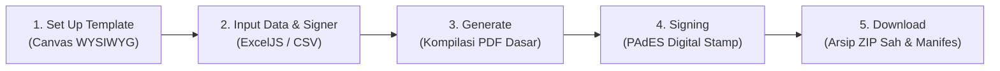

<div align="center">

# 🦫 PRC Certificate Generator & PAdES Multi-Signer

**Platform Web Modern untuk Desain Template Sertifikat, Pengolahan Data Massal, dan Penandatanganan Digital Kriptografis PAdES**

[](https://react.dev/)
[](https://www.typescriptlang.org/)
[](https://vitejs.dev/)
[](https://bun.sh/)
[](https://fabricjs.com/)
[](https://github.com/exceljs/exceljs)
[](https://opensource.org/licenses/MIT)
[](https://github.com/pengikut-raja-capybara)
[](https://github.com/pengikut-raja-capybara)

</div>

---

> [!WARNING]
> **Status Proyek: Masih Dalam Tahap Pengembangan (Work in Progress / WIP)**  
> Repositori ini masih berada dalam tahap **pengembangan aktif dan riset implementasi**. Aplikasi ini **belum merupakan produk akhir yang siap pakai (not production-ready)**. Fitur, format struktur data, alur penandatanganan, serta antarmuka pengguna dapat mengalami perubahan signifikan sewaktu-waktu.

---

## 📖 Tentang Proyek

**PRC Certificate Generator** adalah aplikasi web *client-side* modern yang dikembangkan di bawah naungan organisasi **Pengikut Raja Capybara**. Aplikasi ini dirancang untuk mempermudah institusi, perguruan tinggi, maupun komunitas dalam merancang template sertifikat secara visual (*WYSIWYG*), memproses data penerima massal via spreadsheet (Excel/CSV), melakukan kompilasi PDF resolusi tinggi langsung di browser, serta menyematkan tanda tangan digital sah berstandar **PAdES (PDF Advanced Electronic Signatures)** dengan sertifikat digital **X.509 (PKI)** dan stempel kriptografis bertahap (*incremental lazy visual stamping*).

Semua proses rendering grafis, pembuatan PDF, kalkulasi digest, hingga penandatanganan kriptografi dilakukan **100% di sisi klien (browser-based)** tanpa mengirimkan data sensitif ke server eksternal.

---

## 🌟 Fitur Utama

### 1. 🎨 Visual WYSIWYG Template Designer
- **Kanvas Interaktif Fabric.js v7**: Kanvas responsif dengan skala pas layar (*auto-fit viewport*) yang tidak pernah terpotong di berbagai resolusi layar.
- **Elemen Dinamis & Fleksibel**:
  - Teks Dinamis variabel (misal: `{{nama}}`, `{{nomor_sertifikat}}`, `{{nim}}`, `{{prodi}}`).
  - Teks Statis dengan dukungan tipografi Google Fonts (Inter, Playfair Display, Montserrat, Roboto, dll.).
  - Kode QR dinamis untuk verifikasi sertifikat.
  - Ornamen grafis dan latar belakang sertifikat kustom.
- **Slot Stempel TTD Digital (PAdES Visual Stamp)**:
  - **Style A (Formal Academic)**: Format teks pejabat formal berdampingan dengan QR verifikasi.
  - **Style B (Centered Minimalist)**: QR verifikasi terpusat di atas nama pejabat.
  - **Style C (Clean Typography)**: Tipografi minimalis modern.
- **Precision Rulers & Guides**:
  - Penggaris horizontal & vertikal dalam satuan poin (`pt`).
  - Garis pembantu kursor realtime (*crosshair cursor*) putus-putus dengan indikator koordinat `X, Y pt`.
  - Garis panduan (*guide lines*) yang dapat ditarik langsung dari penggaris.
- **Template Management**: Simpan dan muat kembali struktur template dalam format `.json`.

### 2. 📊 Spreadsheet IO Tangguh (ExcelJS)
- **Ekspor Format Template Otomatis**:
  - Kolom otomatis disesuaikan dengan seluruh variabel yang ada di kanvas.
  - Lebar kolom otomatis (*auto-width*) dan header biru primer elegan.
  - Baris contoh pengisian realistis.
- **Parser Cerdas**:
  - Pembersihan spasi otomatis pada header kolom (*header trimming*).
  - Konversi otomatis tipe data tanggal (*Date*) menjadi format teks Indonesia (`DD MMMM YYYY`), mencegah munculnya angka serial mentah Excel (`45546`).
  - Ekstraksi hasil formula dan teks berformat (*rich text*).
  - Pengabaian otomatis baris kosong (*empty rows*).
- **Tabel Data Interaktif**: Tambah, edit, hapus data langsung di antarmuka web, serta ekspor kembali data aktif ke `.xlsx`.

### 3. ⚡ Kompilasi PDF Berkecepatan Tinggi
- Kompilasi berkas PDF berkecepatan tinggi menggunakan pustaka vector `@libpdf/core` dan `pdf-lib` langsung di memori browser.
- Rendering grafis tajam (300 DPI) siap cetak.
- **Manifes Integritas Kriptografis (`LIGHTSIGN-v1`)**:
  - Penghitungan digest SHA-256 berkas PDF dasar.
  - Hashing daftar pejabat berwenang (*user list hash*).
  - Penyiapan manifes integritas untuk verifikasi anti-tamper.

### 4. 🔏 Penandatanganan Digital PAdES (Multi-Signer PKI)
- **Standar PAdES**: Tanda tangan digital disematkan langsung ke dalam struktur PDF dan terbaca sah oleh penampil PDF standar (*Adobe Acrobat Reader, Foxit Reader, Web Browsers*).
- **Multi-Signature Incremental**: Setiap pejabat menandatangani dokumen secara independen tanpa merusak atau membatalkan validitas tanda tangan pejabat sebelumnya.
- **Lazy Visual Stamping**: Stempel visual tanda tangan dicap secara bertahap hanya saat pejabat yang bersangkutan menandatangani dokumen.
- **Bebas Urutan (Order-Independent)**: Pejabat mana pun dapat menandatangani lebih dulu (Rektor, Dekan, atau Ketua Panitia).
- **Kriptografi Standar Industri**: RSA-2048, X.509 Certificates, PKCS#12 (`.p12` keystores), hashing SHA-256.
- **Batch Signing 1-Klik**: Penandatanganan massal untuk ratusan sertifikat sekaligus dengan indikator progres real-time.

### 5. 📦 Distribusi & Verifikasi Lengkap
- **Ekspor ZIP**: Seluruh sertifikat yang sah beserta manifes integritas (`.sig.json`) dikemas rapi ke dalam satu arsip ZIP via `JSZip`.
- **Verifikasi Integritas**: Pengecekan validitas sertifikat X.509 dan keutuhan dokumen secara mandiri.

### 6. 🛡️ PKI & Keystore Management Hub
- Pembuatan Root CA dan sertifikat penandatangan lokal mandiri.
- Ekspor & impor sertifikat X.509 (`.crt`), private key RSA, dan bundel PKCS#12 (`.p12`).
- Penyimpanan lokal persisten dan terisolasi di browser via `localforage` (IndexedDB).

---

## 🧭 Alur Kerja 5 Tahap (Guided Workflow)



1. **Step 1: Set Up Template**: Rancang tata letak sertifikat, atur teks dinamis/statis, masukkan latar belakang, dan tentukan letak slot stempel tanda tangan.
2. **Step 2: Input Data & Signer**: Unduh template Excel atau unggah data penerima (`.xlsx`/`.csv`), lalu petakan pejabat penandatangan ke masing-masing slot stempel.
3. **Step 3: Generate Certificate**: Kompilasi seluruh dokumen PDF dasar beresolusi tinggi dan siapkan manifes kriptografis `LIGHTSIGN-v1`.
4. **Step 4: Signing**: Eksekusi penandatanganan digital PAdES untuk masing-masing pejabat berwenang dengan stempel visual bertahap.
5. **Step 5: Download**: Unduh seluruh sertifikat PDF yang telah sah bersama berkas manifes integritas dalam satu arsip ZIP.

---

## 🛠️ Tumpukan Teknologi (Tech Stack)

| Kategori | Teknologi | Kegunaan |
|---|---|---|
| **Core Framework** | [React 19](https://react.dev/), [TypeScript](https://www.typescriptlang.org/), [Vite 8](https://vitejs.dev/) | Fondasi aplikasi web modern super cepat dan modular |
| **Package Manager** | [Bun](https://bun.sh/) | Package manager dan runtime performa tinggi |
| **Canvas Engine** | [Fabric.js v7](https://fabricjs.com/) | Engine manipulasi visual kanvas interaktif WYSIWYG |
| **Spreadsheet Engine** | [ExcelJS](https://github.com/exceljs/exceljs) | Pembacaan, formatting, dan pembuatan berkas `.xlsx`/`.csv` |
| **PDF Processing** | [PDF-Lib](https://pdf-lib.js.org/), [@libpdf/core](https://www.npmjs.com/package/@libpdf/core) | Pembuatan dan manipulasi dokumen PDF berbasis vektor |
| **Cryptography** | [Node-Forge](https://github.com/digitalbazaar/forge), Web Crypto API | Implementasi PKI, X.509, RSA-2048, PKCS#12, SHA-256 |
| **QR Code Engine** | [qrcode](https://www.npmjs.com/package/qrcode) | Pembangkitan QR code verifikasi dinamis pada stempel |
| **Archiving** | [JSZip](https://stuk.github.io/jszip/) | Pembuatan arsip `.zip` sertifikat massal |
| **UI Components** | Vanilla CSS, [Lucide React](https://lucide.dev/), [SweetAlert2](https://sweetalert2.github.io/) | Tampilan antarmuka dark modern bersih dan responsif |
| **State Management** | [Zustand](https://github.com/pmndrs/zustand) | Manajemen status global reaktif |
| **Persistent Storage** | [LocalForage](https://localforage.github.io/localForage/) | Penyimpanan keystore lokal di IndexedDB peramban |

---

## 📁 Struktur Direktori

```
prc-certificate-generator/
├── public/                  # Aset publik statis
├── src/
│   ├── assets/              # Aset gambar & template bawaan
│   ├── components/
│   │   ├── editor/          # Kanvas Fabric.js, Toolbar, RulerGuide, PropertiesPanel, LayerPanel
│   │   ├── generator/       # Tampilan batch generator independen
│   │   ├── keys/            # Pengelola sertifikat PKI X.509 & PKCS#12
│   │   ├── layout/          # AppShell & Navigasi Utama
│   │   ├── shared/          # Reusable Tooltip (Portal), PdfPreviewModal, Badges
│   │   ├── signing/         # Tampilan batch signing independen
│   │   └── workflow/        # Komponen Alur Kerja 5-Tahap:
│   │                        # - WorkflowStepper (Navigasi Header)
│   │                        # - InputDataStep (ExcelJS IO & Signer Mapping)
│   │                        # - GenerateStep (PDF compilation & preview)
│   │                        # - SigningStep (Multi-Signer PAdES execution)
│   │                        # - DownloadStep (ZIP packaging)
│   ├── data/                # Template default & kunci bawaan
│   ├── lib/
│   │   ├── alerts.ts        # Helper SweetAlert2 tema dark modern
│   │   ├── batch-generator.ts # Engine ExcelJS & generator sertifikat massal
│   │   ├── ca.ts            # Pembangkit Root CA & X.509 certificate
│   │   ├── crypto.ts        # Hashing SHA-256 & verifikasi tanda tangan
│   │   ├── key-manager.ts   # Manajemen persistensi kunci di browser via IndexedDB
│   │   ├── pdf-renderer.ts  # Renderer kanvas ke PDF vektor
│   │   ├── signing-pipeline.ts # Pipeline PAdES incremental multi-signing
│   │   └── stamp-renderer.ts   # Rendering stempel pejabat & QR verifikasi
│   ├── stores/              # Zustand state management:
│   │                        # - editor-store: kanvas, elemen, zoom, undo/redo
│   │                        # - generator-store: data rows, signer map, dokumen hasil
│   │                        # - keys-store: sertifikat pejabat & kunci PKI
│   └── types/               # Definisi TypeScript interface & types
├── .gitignore               # Konfigurasi pengabaian berkas Git
├── .oxlintrc.json           # Konfigurasi linter Oxlint
├── index.html               # Entri HTML utama
├── package.json             # Dependensi & skrip proyek
├── tsconfig.json            # Konfigurasi TypeScript
└── vite.config.ts           # Konfigurasi bundler Vite
```

---

## 🚀 Panduan Memulai Cepat

### Prasyarat
Pastikan Anda telah memasang salah satu runtime berikut di komputer Anda:
- [Bun](https://bun.sh/) (Sangat direkomendasikan, versi 1.1+)
- [Node.js](https://nodejs.org/) (Versi 20+)

### 1. Pasang Dependensi
```bash
bun install
# atau menggunakan npm:
# npm install
```

### 2. Jalankan Server Pengembangan
```bash
bun run dev
# atau:
# npm run dev
```
Buka peramban di `http://localhost:5173/`.

### 3. Perintah yang Tersedia

| Perintah | Deskripsi |
|---|---|
| `bun run dev` | Menjalankan Vite dev server dengan fitur Hot Module Replacement (HMR) |
| `bun run build` | Menjalankan type-check (`tsc -b`) dan build produksi ke folder `dist/` |
| `bun run lint` | Menjalankan Oxlint untuk analisis statis kode berkecepatan tinggi |
| `bun run preview` | Menjalankan preview lokal terhadap hasil build produksi |

---

## 📜 Spesifikasi Protokol Kriptografi Dokumen

Aplikasi ini menerapkan protokol pengesahan dokumen **`LIGHTSIGN-v1`**:
- **Document Digest Formula**:
  $$\text{Digest} = \text{SHA-256}(\text{bytes}(D_{\text{base}}))$$
- **Signer Manifest Hashing**: Setiap pejabat yang tercantum pada slot sertifikat memiliki hash identitas unik yang divalidasi silang saat stempel visual ditempelkan.
- **Kunci Publik & Sertifikat**: Pasangan kunci RSA-2048 berstandar X.509 v3 yang diterbitkan oleh institusi (Root CA) dan disimpan secara aman di keystore browser pengguna.
- **Verifikasi Offline**: Informasi tanda tangan dan hash manifes dimuat di dalam QR Code stempel, memungkinkan verifikasi keaslian dokumen secara luring (*offline verification*) tanpa bergantung pada server verifikasi terpusat.

---

## 🤝 Kontribusi & Komunitas

Dikembangkan dan dikelola dengan penuh cinta oleh komunitas **[Pengikut Raja Capybara](https://github.com/pengikut-raja-capybara)**.

Kontribusi, pelaporan bug, dan saran fitur sangat kami hargai! Silakan buka *issue* atau kirimkan *pull request* ke repositori ini.

---

## 📄 Lisensi

Proyek ini dilisensikan di bawah lisensi **MIT**. Silakan gunakan, modifikasi, dan distribusikan sesuai kebutuhan Anda.
