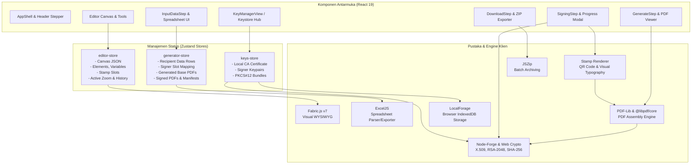
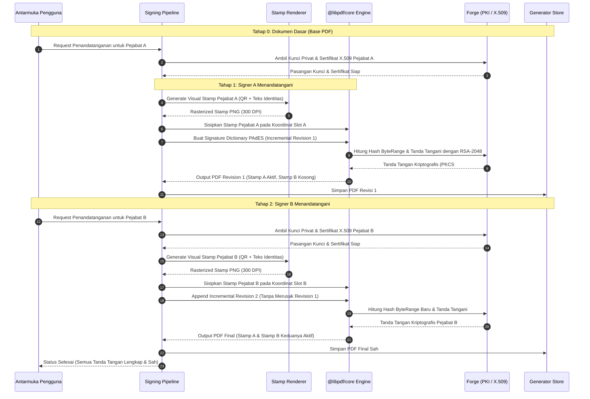
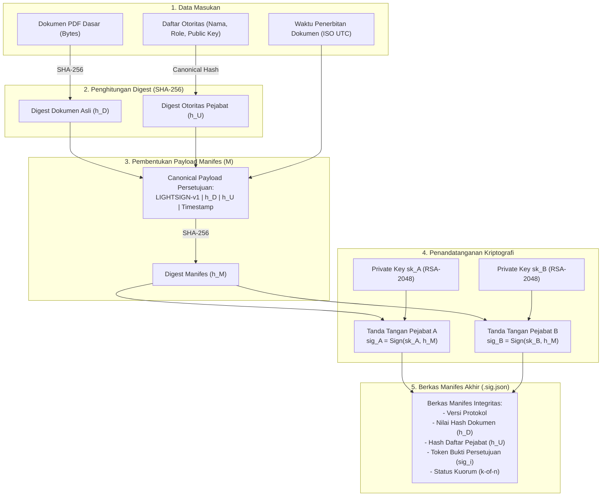
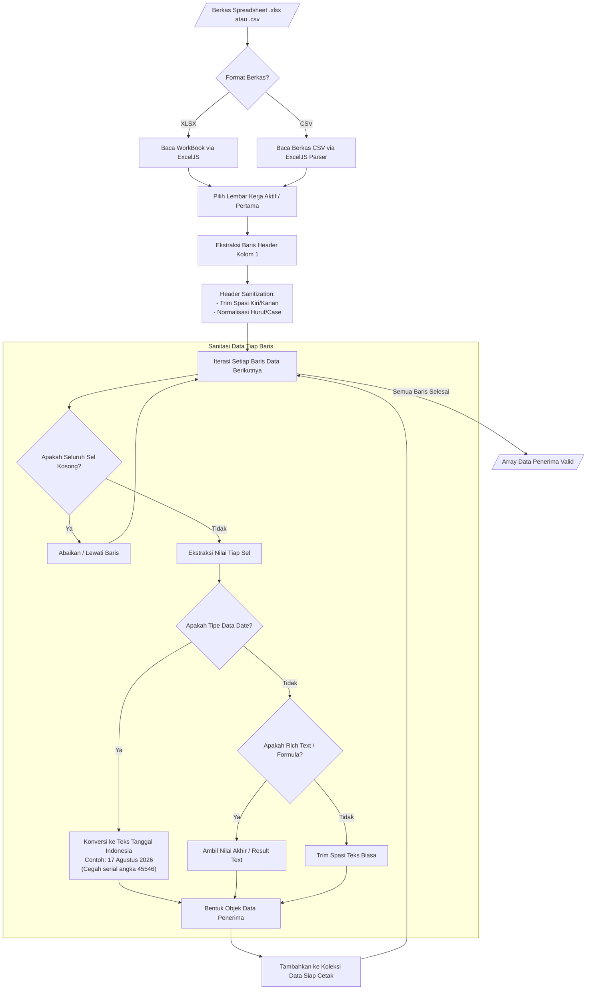
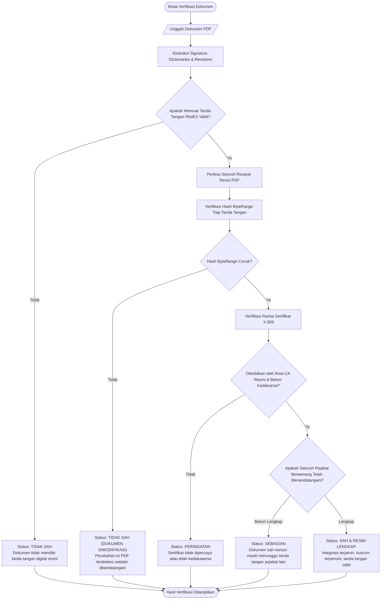

# 📐 Arsitektur & Alur Kerja Sistem (Flow Charts)

Dokumen ini memuat arsitektur teknis, diagram alur (*flowcharts*), diagram sekuensial (*sequence diagrams*), dan alur kriptografis pada aplikasi **PRC Certificate Generator & PAdES Multi-Signer** menggunakan visualisasi standar **Mermaid**.

---

## 📑 Daftar Isi
1. [Alur Kerja Pengguna (End-to-End User Journey)](#1-alur-kerja-pengguna-end-to-end-user-journey)
2. [Arsitektur Data & Komponen (System Architecture)](#2-arsitektur-data--komponen-system-architecture)
3. [Alur Pipeline Multi-Signer & Lazy Stamping](#3-alur-pipeline-multi-signer--lazy-stamping)
4. [Proses Kriptografi Manifes Dokumen (LIGHTSIGN-v1)](#4-proses-kriptografi-manifes-dokumen-lightsign-v1)
5. [Alur Pembacaan & Sanitasi Spreadsheet (ExcelJS Engine)](#5-alur-pembacaan--sanitasi-spreadsheet-exceljs-engine)
6. [Alur Verifikasi Dokumen Digital (Verification Flow)](#6-alur-verifikasi-dokumen-digital-verification-flow)

---

## 1. Alur Kerja Pengguna (End-to-End User Journey)

Alur kerja aplikasi dirancang dalam **5 Tahap Terpadu (Guided Stepper Workflow)** untuk memandu pengguna dari perancangan visual hingga pengunduhan sertifikat akhir.

```mermaid
flowchart TD
    Start(["Mulai Aplikasi"]) --> Step1["Langkah 1: Setup Template"]
    
    subgraph S1["Langkah 1: WYSIWYG Template Designer"]
        Step1 --> S1_Canvas["Kanvas Interaktif Fabric.js"]
        S1_Canvas --> S1_Bg["Upload Gambar Latar / Background"]
        S1_Canvas --> S1_Text["Tambah Teks Statis & Variabel Dinamis (nama, nomor, dll.)"]
        S1_Canvas --> S1_Stamp["Tentukan Posisi Slot Stempel TTD & Style A/B/C"]
        S1_Stamp --> S1_Save["Simpan Template ke JSON / LocalStorage"]
    end
    
    S1_Save --> Step2["Langkah 2: Input Data & Signer"]
    
    subgraph S2["Langkah 2: Pengolahan Data & Penentuan Pejabat"]
        Step2 --> S2_Format["Unduh Template Format Excel Otomatis"]
        S2_Format --> S2_Upload["Unggah File Data .xlsx atau .csv"]
        S2_Upload --> S2_Parse["Parser Cerdas ExcelJS: Trimming & Format Tanggal"]
        S2_Parse --> S2_Map["Petakan Pejabat Penandatangan ke Slot Stempel"]
        S2_Map --> S2_Table["Tinjau / Edit Data Penerima di Tabel"]
    end
    
    S2_Table --> Step3["Langkah 3: Generate Base PDF"]
    
    subgraph S3["Langkah 3: Kompilasi Dokumen PDF Dasar"]
        Step3 --> S3_Loop["Iterasi Tiap Baris Data Penerima"]
        S3_Loop --> S3_Replace["Substitusi Variabel Dinamis (nama, no_sertifikat, dll.)"]
        S3_Replace --> S3_Compile["Render PDF Vektor Resolusi Tinggi via PDF-Lib"]
        S3_Compile --> S3_Hash["Hitung SHA-256 Digest Dokumen Dasar (h_D)"]
        S3_Hash --> S3_Preview["Pratinjau PDF Dasar di Modal Web"]
    end
    
    S3_Preview --> Step4["Langkah 4: Multi-Signer PAdES Signing"]
    
    subgraph S4["Langkah 4: Penandatanganan Kriptografis Bertingkat"]
        Step4 --> S4_KeyCheck["Periksa Kunci X.509 / PKCS#12 di Browser Keystore"]
        S4_KeyCheck --> S4_Sign1["Batch Sign Pejabat 1 (Contoh: Dekan)"]
        S4_Sign1 --> S4_Lazy1["Lazy Stamping: Tempel Stempel Visual 1 & Signature #1"]
        S4_Lazy1 --> S4_Sign2["Batch Sign Pejabat 2 (Contoh: Rektor)"]
        S4_Sign2 --> S4_Lazy2["Lazy Stamping: Tempel Stempel Visual 2 & Signature #2"]
        S4_Lazy2 --> S4_Complete["Validasi Seluruh Kuorum Tanda Tangan Selesai"]
    end
    
    S4_Complete --> Step5["Langkah 5: Download & Distribusi"]
    
    subgraph S5["Langkah 5: Pengemasan & Ekspor"]
        Step5 --> S5_Pack["Kemas Semua PDF Sah ke Arsip ZIP via JSZip"]
        S5_Pack --> S5_Manifest["Sertakan Berkas Manifes Kriptografis .sig.json"]
        S5_Manifest --> S5_Export["Unduh Berkas ZIP ke Perangkat Lokal"]
    end
    
    S5_Export --> Finish(["Selesai / Sertifikat Siap Didistribusikan"])
```

---

## 2. Arsitektur Data & Komponen (System Architecture)

Aplikasi dibangun berbasis arsitektur *clean state-driven* dengan **Zustand** sebagai pengelola status reaktif dan modular:

---

## 3. Alur Pipeline Multi-Signer & Lazy Stamping

Salah satu keunggulan teknis utama adalah **Lazy Visual Stamping** dan **Incremental Multi-Signing PAdES**. Stempel tanda tangan tidak dicap saat pembuatan template, melainkan hanya muncul saat pejabat terkait mengeksekusi tanda tangan digitalnya. Urutan penandatanganan bersifat bebas (*order-independent*).

---

## 4. Proses Kriptografi Manifes Dokumen (`LIGHTSIGN-v1`)

> 🧮 **Rumus Matematis Lengkap**:
> Untuk penjabaran formal notasi matematika ($h_D$, $h_U$, $h_M$, $\sigma_i$, $N_{\text{valid}}$, kuorum $k$-of-$n$, dan model biner PAdES), silakan baca dokumen spesifikasi **[docs/SIGNING_FORMULA.md](SIGNING_FORMULA.md)**.

Diagram berikut menjelaskan bagaimana integritas dokumen, daftar pejabat berwenang, dan bukti persetujuan diikat menjadi satu manifes digital anti-manipulasi:

---

## 5. Alur Pembacaan & Sanitasi Spreadsheet (ExcelJS Engine)

Modul **Spreadsheet IO** menggunakan pustaka `ExcelJS` dengan pembersihan otomatis untuk menjamin kebersihan data sebelum disubstitusikan ke template sertifikat:

---

## 6. Alur Verifikasi Dokumen Digital (Verification Flow)

Diagram alur berikut mengilustrasikan bagaimana berkas sertifikat diperiksa integritasnya secara luring (*offline verification*) atau melalui portal web:

---

## 💡 Ringkasan Praktik Terbaik

- **Keamanan Tanpa Kompromi**: Tanda tangan digital disematkan di tingkat biner PDF (`Incremental Updates`), sehingga compliant dengan pembaca PDF seperti Adobe Acrobat.
- **Kedaulatan Data Penuh**: Tidak ada satu byte pun dokumen penerima atau kunci privat yang meninggalkan peramban.
- **Transparansi Matematika**: Setiap hash dan proses enkripsi dapat divalidasi silang menggunakan perkakas standar industri (`openssl`, `sha256sum`).
