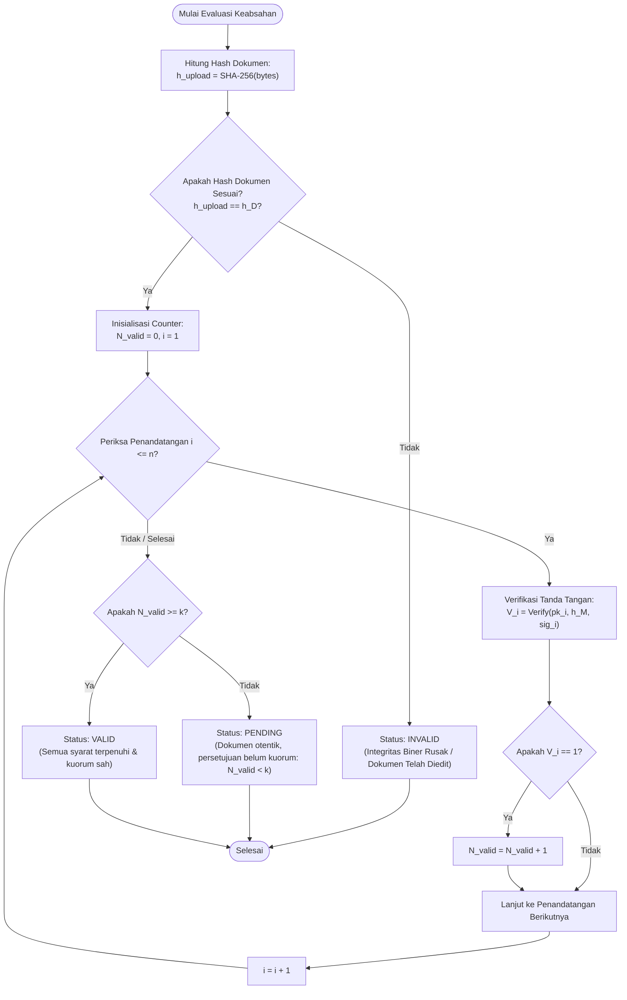

# 🧮 Rumus & Spesifikasi Matematis Alur Penandatanganan Digital (Signing Formula)

Dokumen ini memuat spesifikasi formal, notasi aljabar, rumus matematika kriptografis, dan logika evaluasi keabsahan untuk sistem tanda tangan digital bertingkat (*multi-signer*) pada **PRC Certificate Generator & PAdES Signer**.

---

## 📑 Daftar Isi
1. [Notasi & Variabel Formal](#1-notasi--variabel-formal)
2. [Hash Integritas Dokumen Dasar](#2-hash-integritas-dokumen-dasar)
3. [Pengikatan Identitas Penandatangan](#3-pengikatan-identitas-penandatangan)
4. [Payload Persetujuan Kanonikal (LIGHTSIGN-v1)](#4-payload-persetujuan-kanonikal-lightsign-v1)
5. [Rumus Pembuatan Tanda Tangan Kriptografis](#5-rumus-pembuatan-tanda-tangan-kriptografis)
6. [Model Incremental Update PAdES](#6-model-incremental-update-pades)
7. [Akumulasi Validasi & Kebijakan Kuorum](#7-akumulasi-validasi--kebijakan-kuorum)
8. [Rumus Verifikasi & Keabsahan Dokumen Akhir](#8-rumus-verifikasi--keabsahan-dokumen-akhir)
9. [Diagram Alur Evaluasi Matematis (Mermaid)](#9-diagram-alur-evaluasi-matematis-mermaid)

---

## 1. Notasi & Variabel Formal

| Simbol / Variabel | Domain / Definisi | Deskripsi |
| :--- | :--- | :--- |
| $D_{\text{base}}$ | $D_{\text{base}} \in \{0, 1\}^*$ | Berkas biner PDF dasar sebelum tanda tangan apapun dibubuhkan |
| $D_{\text{upload}}$ | $D_{\text{upload}} \in \{0, 1\}^*$ | Berkas biner PDF yang diperiksa saat proses verifikasi |
| $H(x)$ | $\{0, 1\}^* \to \{0, 1\}^{256}$ | Fungsi ringkasan kriptografi SHA-256 |
| $h_D$ | $h_D = H(D_{\text{base}})$ | Hash unik 256-bit (*digest*) dari dokumen dasar |
| $U$ | $U = (u_1, u_2, \dots, u_n)$ | Vektor urutan kanonikal penandatangan terdaftar |
| $n$ | $n = \vert U \vert \in \mathbb{N}^+$ | Jumlah total pejabat/penandatangan yang terdaftar ($n \ge 1$) |
| $k$ | $k \in \mathbb{N}^+, \; 1 \le k \le n$ | Ambang batas minimum persetujuan yang sah (*quorum*) |
| $sk_i$ | $\text{RSA-2048 Private Key}$ | Kunci privat milik pejabat ke-$i$ |
| $pk_i$ | $\text{RSA-2048 Public Key}$ | Kunci publik milik pejabat ke-$i$ (terdapat pada sertifikat X.509) |
| $\sigma_i$ | $\sigma_i \in \{0, 1\}^*$ | Tanda tangan digital kriptografis dari pejabat ke-$i$ |
| $V_i$ | $V_i \in \{0, 1\}$ | Nilai biner keabsahan tanda tangan pejabat ke-$i$ ($1$ = Sah, $0$ = Batal/Belum) |
| $N_{\text{valid}}$ | $N_{\text{valid}} = \sum_{i=1}^n V_i$ | Total jumlah tanda tangan sah yang berhasil diverifikasi |
| $M$ | $M \in \{0, 1\}^*$ | *Canonical payload* persetujuan manifes dokumen |
| $h_M$ | $h_M = H(M)$ | Hash dari payload persetujuan kanonikal |

---

## 2. Hash Integritas Dokumen Dasar

Saat dokumen sertifikat pertama kali digenerate oleh sistem (Tahap 3: Generate Base PDF), sistem menghitung sidik jari kriptografis dokumen:

$$
h_D = H(D_{\text{base}}) = \text{SHA-256}(\text{bytes}(D_{\text{base}}))
$$

### Sifat Matematis:
1. **Resistensi Tabrakan (*Collision Resistance*)**: Secara komputasi mustahil menemukan dokumen $D' \ne D_{\text{base}}$ sedemikian sehingga $H(D') = H(D_{\text{base}})$.
2. **Efek Longsoran (*Avalanche Effect*)**: Perubahan terkecil sebesar 1 bit pada berkas $D_{\text{base}}$ akan mengubah secara acak rata-rata 50% dari 256 bit nilai $h_D$.

---

## 3. Pengikatan Identitas Penandatangan

Untuk mencegah modifikasi atau penyisipan penandatangan siluman setelah dokumen diterbitkan, daftar pejabat yang berwenang diikat secara matematis ke dalam satu *canonical hash* $h_U$:

$$
h_U = H\Big(\text{"LIGHTSIGN-v1"} \parallel u_1 \parallel \text{role}_1 \parallel pk_1 \parallel \dots \parallel u_n \parallel \text{role}_n \parallel pk_n\Big)
$$

Di mana:
- $\parallel$ melambangkan operator konkatenasi string biner (*canonical concatenation*).
- Setiap elemen dipisahkan dengan pembatas deterministik (`|`).

---

## 4. Payload Persetujuan Kanonikal (`LIGHTSIGN-v1`)

Seluruh pejabat berwenang menandatangani objek data kanonikal yang seragam ($M$). Hal ini menjamin bahwa seluruh pihak menyepakati berkas yang sama, kelompok otoritas yang sama, dan kuorum yang sama:

$$
M = \text{protocol} \parallel \text{document-id} \parallel h_D \parallel h_U \parallel \text{policy} \parallel k \parallel n \parallel \text{version}
$$

Contoh bentuk representasi string terstandarisasi:
```text
LIGHTSIGN-v1|CERT-2026-0091|e3b0c44298fc1c149afbf4c8...|a4f13b2c...|k-of-n|2|2|1
```

Hash dari payload kanonikal tersebut:

$$
h_M = H(M) = \text{SHA-256}(M)
$$

---

## 5. Rumus Pembuatan Tanda Tangan Kriptografis

Setiap pejabat berwenang $u_i$ membubuhkan tanda tangan digital menggunakan kunci privat miliknya $sk_i$ terhadap hash kanonikal $h_M$:

$$
\sigma_i = \text{Sign}_{sk_i}(h_M) = \text{RSA-SHA256-PKCS1v15}(sk_i, h_M)
$$

### Fungsi Verifikasi Tanda Tangan:
Verifikasi dilakukan menggunakan kunci publik $pk_i$ yang diekstraksi dari sertifikat X.509 resmi pejabat:

$$
V_i = \text{Verify}(pk_i, h_M, \sigma_i) = \begin{cases} 
1, & \text{jika tanda tangan cocok dan sertifikat valid} \\ 
0, & \text{jika tanda tangan cacat, dipalsukan, atau belum ditandatangani} 
\end{cases}
$$

---

## 6. Model Incremental Update PAdES

Dalam standar **PAdES (ETSI EN 319 142)**, tanda tangan digital disematkan tanpa mengubah biner revisi sebelumnya. Berkas biner PDF setelah penandatanganan ke-$j$ dimodelkan sebagai deret penambahan (*byte append series*):

$$
D_j = D_{j-1} \parallel \Delta_j \quad \text{untuk } j \in \{1, 2, \dots, m\}
$$

Di mana:
- $D_0 = D_{\text{base}}$ (berkas awal hasil kompilasi).
- $\Delta_j$ adalah blok penambahan biner yang memuat:
  1. *Visual stamp annotation dictionary* pada koordinat slot $(x_j, y_j, w_j, h_j)$.
  2. *Signature Dictionary* `/Type /Sig` dengan filter `/Adobe.PPKLite` dan sub-filter `/adbe.pkcs7.detached`.
  3. Larik byte rentang `/ByteRange [0, \text{offset}_1, \text{offset}_2, \text{length}_2]`.

Integritas byte range tingkat biner memenuhi rumus:

$$
h_{\text{revision}, j} = \text{SHA-256}\Big(\text{bytes}(D_j) \setminus \text{Contents}(\sigma_j)\Big)
$$

---

## 7. Akumulasi Validasi & Kebijakan Kuorum

Jumlah total tanda tangan sah yang terkumpul dihitung melalui fungsi agregasi:

$$
N_{\text{valid}} = \sum_{i=1}^{n} V_i
$$

### Aturan Kebijakan Persetujuan:

1. **Kebijakan Kuorum Ambang Batas ($k$-of-$n$ Quorum Policy)**:
   Dokumen memenuhi syarat pengesahan jika dan hanya jika:
   $$
   N_{\text{valid}} \ge k
   $$

2. **Kebijakan Persetujuan Mutlak ($k = n$)**:
   Semua pejabat yang terdaftar wajib menandatangani:
   $$
   \sum_{i=1}^n V_i = n
   $$

---

## 8. Rumus Verifikasi & Keabsahan Dokumen Akhir

Keabsahan akhir dokumen sertifikat yang diuji ($D_{\text{upload}}$) dievaluasi melalui konjungsi logika (*logical conjunction*):

$$
\boxed{\mathbf{VALID} \iff \Big( H(D_{\text{upload}}) = h_D \;\lor\; \text{VerifyRevisionHistory}(D_{\text{upload}}, h_D) = \text{True} \Big) \;\land\; \left( \sum_{i=1}^n V_i \ge k \right)}
$$

### Fungsi Keputusan Status Sistem:

$$
\text{StatusDokumen} = \begin{cases} 
\mathbf{VALID}, & \text{jika } \text{IntegritasDokumen} = \text{True} \;\land\; \displaystyle\sum_{i=1}^n V_i \ge k \\[10pt]
\mathbf{PENDING}, & \text{jika } \text{IntegritasDokumen} = \text{True} \;\land\; \displaystyle\sum_{i=1}^n V_i < k \\[10pt]
\mathbf{INVALID}, & \text{jika } \text{IntegritasDokumen} = \text{False}
\end{cases}
$$

---

## 9. Diagram Alur Evaluasi Matematis (Mermaid)



---

## 💡 Ringkasan Implementasi

Formula matematis di atas diimplementasikan pada kode sumber:
- Penghitungan digest & verifikasi hash: [`src/lib/crypto.ts`](file:///e:/certificate-generator/prc-certificate-generator/src/lib/crypto.ts)
- Pengikatan PAdES incremental updates: [`src/lib/signing-pipeline.ts`](file:///e:/certificate-generator/prc-certificate-generator/src/lib/signing-pipeline.ts)
- Standarisasi identitas & kanonikal manifes: [`src/lib/standards.ts`](file:///e:/certificate-generator/prc-certificate-generator/src/lib/standards.ts)
